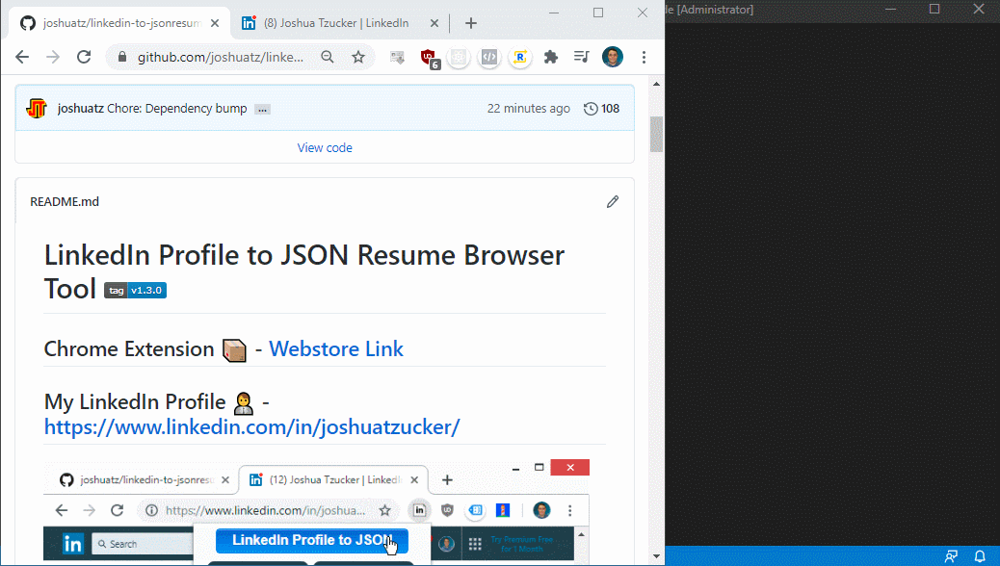

# LinkedIn Profile to JSON Resume Browser Tool 

> An extremely easy-to-use browser extension for exporting your full LinkedIn Profile to a JSON Resume file or string.

## Chrome Extension 📦 - [Webstore Link](https://chrome.google.com/webstore/detail/json-resume-exporter/caobgmmcpklomkcckaenhjlokpmfbdec)

## My LinkedIn Profile 👨‍💼 - [linkedin.com/in/joshuatzucker/](https://www.linkedin.com/in/joshuatzucker/)



## What is JSON Resume?
"JSON Resume" is an open-source standard / schema, currently gaining in adoption, that standardizes the content of a resume into a shared underlying structure that others can use in automated resume formatters, parsers, etc. Read more about it [here](https://jsonresume.org/), or on [GitHub](https://github.com/jsonresume).

## What is this tool?
I made this because I wanted a way to quickly generate a JSON Resume export from my LinkedIn profile, and got frustrated with how locked down the LinkedIn APIs are and how slow it is to request your data export (up to 72 hours). "Install" the tool to your browser, then click to run it while looking at a LinkedIn profile (preferably your own), and my code will grab the various pieces of information off the page and then show a popup with the full JSON resume export that you can copy and paste to wherever you would like.

## A Note About Feature Requests and Bug Reports
I want to make something clear: the only goal of this extension is to be able to export a JSON Resume version of your LinkedIn profile; nothing more, nothing less.

If the tool is malfunctioning or could do a better job of exporting JSON Resume, by all means please open an issue - I always appreciate it!

However, I have gotten several feature requests (as both issues and emails) asking me to extend the tool to do things that are far outside this goal. While I appreciate the interest, ultimately I am not interested in having this project grow outside the original scope - you will usually see me close this issues as `wontfix` and will reply to emails the same way. I have limited time, and this project was originally something I whipped up in a few days for _personal_ use - it has ***already*** gotten way out of scope 😅

---

## Breaking Change - `v1.0` Schema Update
The 10/31/2021 release of this extension (`v3.0.0`) changes the default shape of the JSON exported by this tool, to adhere to the newer `v1` schema offered by JSON Resume:

<details>
	<summary>Previously</summary>

- Stable: `v0.0.16`
- Latest: `v0.1.3`
- Beta: `v0.1.3` + `certificates`
</details>

<details>
	<summary>Version 3.0.0</summary>

- ***Legacy***: `v0.0.16`
- Stable: `v1.0.0`
- Beta: Even with `v1.0.0` (for now)
</details>

## Usage / Installation Options:
There are (or *were*) a few different options for how to use this:
 - **Fast and simple**: Chrome Extension - [Get it here](https://chrome.google.com/webstore/detail/jcaldklkmnjfpjaboilcejindjejbklh/)
     - Feel free to install, use, and then immediately uninstall if you just need a single export
     - No data is collected
 - [***Deprecated***] (at least for now): Bookmarklet
     - This was originally how this tool worked, but had to be retired as a valid method when LinkedIn added a stricter CSP that prevented it from working
     - Code to generate the bookmarklet is still in this repo if LI ever loosens the CSP

### Schema Versions
This tool supports multiple version of [the JSON Resume Schema specification](https://github.com/jsonresume/resume-schema) for export, which you can easily swap between in the dropdown selector! ✨

> "Which schema version should I use?"

If you are unsure, you should probably just stick with *"stable"*, which is the default. It should have the most widespread support across the largest number of platforms.

### Support for Multilingual Profiles
LinkedIn [has a unique feature](https://www.linkedin.com/help/linkedin/answer/1717/create-or-delete-a-profile-in-another-language) that allows you to create different versions of your profile for different languages, rather than relying on limited translation of certain fields.

For example, if you are bilingual in both English and German, you could create one version of your profile for each language, and then viewers would automatically see the correct one depending on where they live and their language settings.

I've implemented support (starting with `v1.0.0`) for multilingual profile export through a dropdown selector:


The dropdown should automatically get populated with the languages that the profile you are currently viewing supports, in addition to your own preferred viewing language in the #1 spot. You should be able to switch between languages in the dropdown and click the export button to get a JSON Resume export with your selected language.

> Note: LinkedIn offers language choices through [a `Locale` string](https://developer.linkedin.com/docs/ref/v2/object-types#LocaleString), which is a combination of `country` (ISO-3166) and `language` (ISO-639). I do not make decisions as to what languages are supported.

> This feature is the part of this extension most likely to break in the future; LI has some serious quirks around multilingual profiles - see [my notes](./docs/LinkedIn-Dev-Notes-README.md#voyager---multilingual-and-locales-support) for details.

### Export Options
There are several main buttons in the browser extension, with different effects. You can hover over each button to see the alt text describing what they do, or read below:
 - *LinkedIn Profile to JSON*: Converts the profile to the JSON Resume format, and then displays it in a popup modal for easy copying and pasting
 - *Download JSON Resume Export*: Same as above, but prompts you to download the result as an actual `.json` file.
 - *Download vCard File*: Export and download the profile as a Virtual Contact File (`.vcf`) (aka *vCard*)
     - There are some caveats with this format; see below


#### vCard Limitations and Caveats
 - Partial birthdate (aka `BDAY`) values (e.g. where the profile has a month and day, but has not opted to share their birth year), are only supported in v4 (RFC-6350) and above. This extension currently only supports v3, so in these situations the tool will simply omit the BDAY field from the export
     - See [#32](https://github.com/joshuatz/linkedin-to-jsonresume/issues/32) for details
 - The LinkedIn display photo (included in vCard) served by LI is a temporary URL, with a fixed expiration date set by LinkedIn. From observations, this is often set months into the future, but could still be problematic for address book clients that don't cache images. To work around this, I'm converting it to a base64 string; this should work with most vCard clients, but also increases the vCard file size considerably.

### Chrome Side-loading Instructions
Instead of installing from the Chrome Webstore, you might might want to "side-load" a ZIP build for either local development, or to try out a new release that has not yet made it through the Chrome review process. Here are the instructions for doing so:

1. Find the ZIP you want to load
     - If you want to side-load the latest version, you can download a ZIP from [the releases tab](https://github.com/joshuatz/linkedin-to-jsonresume/releases/)
     - If you want to side-load a local build, use `npm run package-browserext` to create a ZIP
2. Go to Chrome's extension setting page (`chrome://extensions`)
3. Turn on developer mode (upper right toggle switch)
4. Drag the downloaded zip to the browser to let it install
5. Test it out, then uninstall

You can also unpack the ZIP and load it as "unpacked".

## Troubleshooting
When in doubt, refresh the profile page before using this tool.

### Troubleshooting - Debug Log
If I'm trying to assist you in solving an issue with this tool, I might have you share some debug info. Currently, the easiest way to do this is to use the Chrome developer's console:

1. Append `?li2jr_debug=true` to the end of the URL of the profile you are on
2. Open Chrome dev tools, and specifically, the console ([instructions](https://developers.google.com/web/tools/chrome-devtools/open#console))
3. Run the extension (try to export the profile), and then look for red messages that show up in the console (these are errors, as opposed to warnings or info logs).
    - You can filter to just `error` messages, in the filter dropdown above the console.

---

## Updates:
<details>
    <summary>Update History (Click to Show / Hide)</summary>

Date | Release | Notes
--- | --- | ---
4/9/2022 | 3.2.3 | Fix: Incomplete work listings extraction (see [#68](https://github.com/joshuatz/linkedin-to-jsonresume/issues/68))
12/24/2021 | 3.2.2 | Fix: Broken endpoints (see [#63](https://github.com/joshuatz/linkedin-to-jsonresume/issues/63))
11/14/2021 | 3.2.1 | Fix: Some profiles missing full language proficiency extraction (see [#59](https://github.com/joshuatz/linkedin-to-jsonresume/issues/59))<br/>Fix: Missing Education (regression) (see [#60](https://github.com/joshuatz/linkedin-to-jsonresume/issues/60))
11/7/2021 | 3.2.0 | Improve/Fix: Include location in work positions (see [#58](https://github.com/joshuatz/linkedin-to-jsonresume/issues/58))
11/7/2021 | 3.1.0 | Fix: Incorrect sorting of volunteer positions (see [#55](https://github.com/joshuatz/linkedin-to-jsonresume/issues/55))<br/>Fix: Missing Certificates (see [#59](https://github.com/joshuatz/linkedin-to-jsonresume/issues/59))<br/>Improve/Fix: Extract Language proficiencies / languages (see [#59](https://github.com/joshuatz/linkedin-to-jsonresume/issues/59))<br/>Improve: Cleanup, README update
10/31/2021 | 3.0.0 | **Breaking Update**: This extension has now been updated to output JSON matching the `v1` schema specification released by JSON Resume (see [#53](https://github.com/joshuatz/linkedin-to-jsonresume/pull/53) and [#56](https://github.com/joshuatz/linkedin-to-jsonresume/pull/56)). If you still need the `v0.0.16` schema output, it is no longer the default, but is still available for now under the "legacy" schema option. Thanks @ [anthonyjdella](https://github.com/anthonyjdella) for the PR and code contributions!<br/><br/>Fix: Also rolled into this release is a fix for truncated volunteer experiences (see [#55](https://github.com/joshuatz/linkedin-to-jsonresume/issues/55)). Thanks @ [fkrauthan](https://github.com/fkrauthan) for the heads up!
2/27/2021 | 2.1.2 | Fix: Multiple issues around work history / experience; missing titles, ordering, etc. Overhauled approach to extracting work entries.
12/19/2020 | 2.1.1 | Fix: Ordering of work history with new API endpoint ([#38](https://github.com/joshuatz/linkedin-to-jsonresume/issues/38))
12/7/2020 | 2.1.0 | Fix: Issue with multilingual profile, when exporting your own profile with a different locale than your profile's default. ([#37](https://github.com/joshuatz/linkedin-to-jsonresume/pull/37))
11/12/2020 | 2.0.0 | Support for multiple schema versions ✨ ([#34](https://github.com/joshuatz/linkedin-to-jsonresume/pull/34))
11/8/2020 | 1.5.1 | Fix: Omit partial BDAY export in vCard ([#32](https://github.com/joshuatz/linkedin-to-jsonresume/issues/32))
10/22/2020 | 1.5.0 | Fix: Incorrect birthday month in exported vCards (off by one)<br>Fix: Better pattern for extracting profile ID from URL, fixes extracting from virtual sub-pages of profile (e.g. `/detail/contact-info`), or with query or hash strings at the end.
7/7/2020 | 1.4.2 | Fix: For work positions, if fetched via `profilePositionGroups`, LI ordering (the way it looks on your profile) was not being preserved.
7/31/2020 | 1.4.1 | Fix: In some cases, wrong profileUrnId was extracted from current profile, which led to work history API call being ran against a *different* profile (e.g. from "recommended section", or something like that).
7/21/2020 | 1.4.0 | Fix: For vCard exports, Previous profile was getting grabbed after SPA navigation between profiles.
7/6/2020 | 1.3.0 | Fix: Incomplete work position entries for some users; LI was limiting the amount of pre-fetched data. Had to implement request paging to fix.<br/><br/>Also refactored a lot of code, improved result caching, and other tweaks.
6/18/2020 | 1.2.0 | Fix / Improve VCard export feature.
6/5/2020 | 1.1.0 | New feature: [vCard](https://en.wikipedia.org/wiki/VCard) export, which you can import into Outlook / Google Contacts / etc.
5/31/2020 | 1.0.0 | Brought output up to par with "spec", integrated schemas as TS, added support for multilingual profiles, overhauled JSDoc types.<br><br>Definitely a *breaking* change, since the output has changed to mirror schema more closely (biggest change is `website` in several spots has become `url`)
5/9/2020 | 0.0.9 | Fixed "references", added certificates (behind setting), and formatting tweaks
4/4/2020 | 0.0.8 | Added version string display to popup
4/4/2020 | 0.0.7 | Fixed and improved contact info collection (phone, Twitter, and email). Miscellaneous other tweaks.
10/22/2019 | 0.0.6 | Updated recommendation querySelector after LI changed DOM. Thanks again, @ [lucbpz](https://github.com/lucbpz).
10/19/2019 | 0.0.5 | Updated LI date parser to produce date string compliant with JSONResume Schema (padded). Thanks @ [lucbpz](https://github.com/lucbpz).
9/12/2019 | 0.0.4 | Updated Chrome webstore stuff to avoid LI IP usage (Google took down extension page due to complaint). Updated actual scraper code to grab full list of skills vs just highlighted.
8/3/2019 | NA | Rewrote this tool as a browser extension instead of a bookmarklet to get around the CSP issue. Seems to work great!
7/22/2019 | NA | ***ALERT***: This bookmarklet is currently broken, thanks to LinkedIn adding a new restrictive CSP (Content Security Policy) header to the site. [I've opened an issue](https://github.com/joshuatz/linkedin-to-jsonresume-bookmarklet/issues/1) to discuss this, and both short-term (requires using the console) and long-term (browser extension) solutions.
6/21/2019 | 0.0.3 | I saw the bookmarklet was broken depending on how you came to the profile page, so I refactored a bunch of code and found a much better way to pull the data. Should be much more reliable!
</details>

---

## Development
> With the rewrite to a browser extension, I actually configured the build scripts to be able to still create a bookmarklet from the same codebase, in case the bookmarklet ever becomes a viable option again.

### Building the browser extension
`npm run build-browserext` will transpile and copy all the right files to `./build-browserext`, which you can then side-load into your browser. If you want to produce a single ZIP archive for the extension, `npm run package-browserext` will do that.

> Use `build-browserext-debug` for a source-map debug version. To get more console output, append `li2jr_debug=true` to the query string of the LI profile you are using the tool with.

### Building the bookmarklet version
Currently, the build process looks like this:
 - `src/main.js` -> (`webpack + babel`) -> `build/main.js` -> [`mrcoles/bookmarklet`](https://github.com/mrcoles/bookmarklet) -> `build/bookmarklet_export.js` -> `build/install-page.html`
     - The bookmark can then be dragged to your bookmarks from the final `build/install-page.html`

All of the above should happen automatically when you do `npm run build-bookmarklet`.

If this ever garners enough interest and needs to be updated, I will probably want to re-write it with TypeScript to make it more maintainable. 

### LinkedIn Documentation
For understanding some peculiarities of the LI API, see [LinkedIn-Dev-Notes-README.md](./docs/LinkedIn-Dev-Notes-README.md).

### Debugging
Debugging the extension is a little cumbersome, because of the way Chrome sandboxes extension scripts and how code has to be injected. An alternative to setting breakpoints in the extension code itself, is to copy the output of `/build/main.js` and run it via the console.

```js
li2jr = new LinkedinToResumeJson(true, true);
li2jr.parseAndShowOutput();
```

> Even if you have the repo inside of a local static server, you can't inject it via a script tag or fetch & eval, due to LI's restrictive CSP.

If you do want to find the actual injected code of the extension in Chrome dev tools, you should be able to find it under `Sources -> Content Scripts -> top -> JSON Resume Exporter -> {main.js}`

#### Debugging Snippets
Helpful snippets (subject to change; these rely heavily on internals):

```js
// Get main profileDB (after running extension)
var profileRes = await liToJrInstance.getParsedProfile(true);
var profileDb = await liToJrInstance.internals.buildDbFromLiSchema(profileRes.liResponse);
```

---

## DISCLAIMER:
This tool is not affiliated with LinkedIn in any manner. Intended use is to export your own profile data, and you, as the user, are responsible for using it within the terms and services set out by LinkedIn. I am not responsible for any misuse, or repercussions of said misuse.

## Attribution:
Icon for browser extension:
 - [https://www.iconfinder.com/icons/95928/arrow_down_download_profile_icon](https://www.iconfinder.com/icons/95928/arrow_down_download_profile_icon)