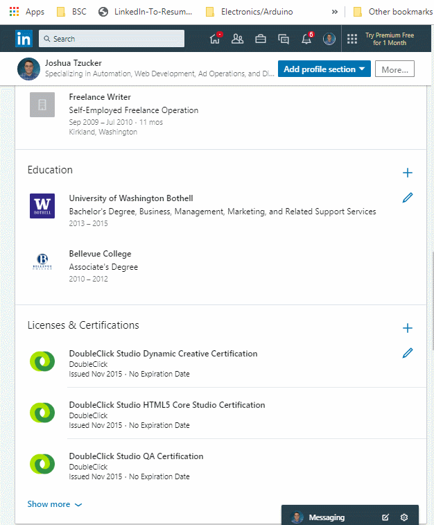

# LinkedIn Profile to JSON Resume Bookmarklet

## Chrome Extension - [Here](https://chrome.google.com/webstore/detail/jcaldklkmnjfpjaboilcejindjejbklh/)

## My LinkedIn Profile :) - [https://www.linkedin.com/in/joshuatzucker/](https://www.linkedin.com/in/joshuatzucker/)



## Usage / Installation Options:
There are a few different options for how to use this:
 - **Fast and simple**: Chrome Extension - [Get it here](https://chrome.google.com/webstore/detail/jcaldklkmnjfpjaboilcejindjejbklh/)
     - Feel free to install, use, and then immediately uninstall if you just need a single export
     - No data is collected
 - **Fast, but manual**: Using browser dev console
     - Step 1: Copy the code from [`main.js`]() into your clipboard
     - Step 2: Navigate to a LinkedIn profile page, then paste the code into your console and run it
     - Step 3: Copy and run the following code:
        ```javascript
        (new LinkedinToResumeJson(false,false)).parseAndShowOutput();
        ```
 - [***Deprecated***] (at least for now): Bookmarklet
     - This was originally how this tool worked, but had to be retired as a valid method when LinkedIn added a stricter CSP that prevented it from working
     - Code to generate the bookmarklet is still in this repo if LI ever loosens the CSP

---

## Updates:
### 8/3/2019:
> Rewrote this tool as a browser extension instead of a bookmarklet to get around the CSP issue. Seems to work great!
### 7/22/2019:
> ***ALERT***: This bookmarklet is currently broken, thanks to LinkedIn adding a new restrictive CSP (Content Security Policy) header to the site. [I've opened an issue](https://github.com/joshuatz/linkedin-to-jsonresume-bookmarklet/issues/1) to discuss this, and both short-term (requires using the console) and long-term (browser extension) solutions.

### 6/21/2019:
> I saw the bookmarklet was broken depending on how you came to the profile page, so I refactored a bunch of code and found a much better way to pull the data. Should be much more reliable!

---

## What is JSON Resume?
"JSON Resume" is an open-source standard / schema, currently gaining in adoption, that standardizes the content of a resume into a shared underlying structure that others can use in automated resume formatters, parsers, etc. Read more about it [here](https://jsonresume.org/), or on [GitHub](https://github.com/jsonresume).

## What is this tool?
I made this because I wanted a way to quickly generate a JSON Resume export from my LinkedIn profile, and got frustrated with how locked down the LinkedIn APIs are and how slow it is to request your data export (up to 72 hours). "Install" the tool to your browser, then click to run it while looking at a LinkedIn profile (preferably your own), and my code will grab the various pieces of information off the page and then show a popup with the full JSON resume export that you can copy and paste to wherever you would like.

---

## Development
> With the rewrite to a browser extension, I actually configured the build scripts to be able to still create a bookmarklet from the same codebase, in case the bookmarklet ever becomes a viable option again.

### Building the browser extension
`npm run build-browserext` will transpile and copy all the right files to `./build-browserext`, which you can then sideload into your browser. If you want to produce a single ZIP archive for the extension, `npm run package-browserext` will do that.

### Building the bookmarklet version
Currently, the build process looks like this:
 - `src/main.js` -> (`webpack + babel`) -> `build/main.js` -> [`mrcoles/bookmarklet`](https://github.com/mrcoles/bookmarklet) -> `build/bookmarklet_export.js` -> `build/install-page.html`
     - The bookmark can then be dragged to your bookmarks from the final `build/install-page.html`

All of the above should happen automatically when you do `npm run build-bookmarklet`.

If this ever garners enough interest and needs to be updated, I will probably want to re-write it with TypeScript to make it more maintainable. 

---

## DISCLAIMER:
This tool is not affiliated with LinkedIn in any manner. Intended use is to export your own profile data, and you, as the user, are responsible for using it within the terms and services set out by LinkedIn. I am not resonsible for any misuse, or reprecussions of said misuse.

## Attribution:
Icon for browser extension:
 - [https://www.iconfinder.com/icons/2470406/brand_linkedin_online_icon](https://www.iconfinder.com/icons/2470406/brand_linkedin_online_icon)
     - Creative Commons (Attribution 3.0 Unported)
     - [Full license](https://creativecommons.org/licenses/by/3.0/)