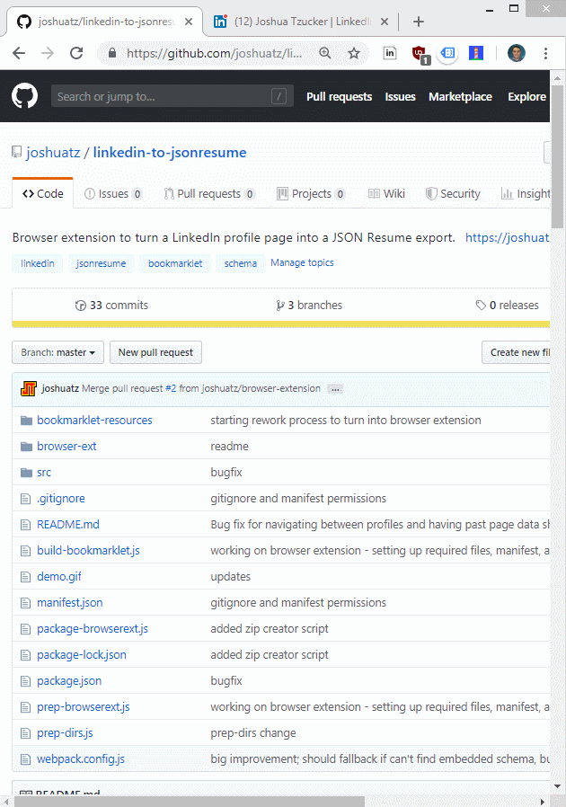
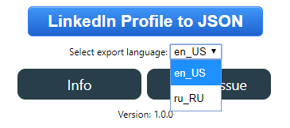

# LinkedIn Profile to JSON Resume Browser Tool 

## Chrome Extension 📦 - [Webstore Link](https://chrome.google.com/webstore/detail/json-resume-exporter/caobgmmcpklomkcckaenhjlokpmfbdec)

## My LinkedIn Profile 👨‍💼 - [https://www.linkedin.com/in/joshuatzucker/](https://www.linkedin.com/in/joshuatzucker/)



## Usage / Installation Options:
There are a few different options for how to use this:
 - **Fast and simple**: Chrome Extension - [Get it here](https://chrome.google.com/webstore/detail/jcaldklkmnjfpjaboilcejindjejbklh/)
     - Feel free to install, use, and then immediately uninstall if you just need a single export
     - No data is collected
 - **Fast, but manual**: Using browser dev console
     - Step 1: Copy the code from [`main.js`](https://github.com/joshuatz/linkedin-to-jsonresume/blob/master/src/main.js) into your clipboard
     - Step 2: Navigate to a LinkedIn profile page, then paste the code into your console and run it
     - Step 3: Copy and run the following code:
        ```javascript
        (new LinkedinToResumeJson(false,false)).parseAndShowOutput();
        ```
 - [***Deprecated***] (at least for now): Bookmarklet
     - This was originally how this tool worked, but had to be retired as a valid method when LinkedIn added a stricter CSP that prevented it from working
     - Code to generate the bookmarklet is still in this repo if LI ever loosens the CSP

### Support for Multilingual Profiles
LinkedIn [has a unique feature](https://www.linkedin.com/help/linkedin/answer/1717/create-or-delete-a-profile-in-another-language) that allows you to create different versions of your profile for different languages, rather than relying on limited translation of certain fields.

For example, if you are bilingual in both English and German, you could create one version of your profile for each language, and then viewers would automatically see the correct one depending on where they live and their language settings.

I've implemented support (starting with `v1.0.0`) for multilingual profile export through a dropdown selector:



The dropdown should automatically get populated with the languages that the profile you are currently viewing supports, in addition to your own preferred viewing language in the #1 spot. You should be able to switch between languages in the dropdown and click the export button to get a JSON Resume export with your selected language.

> Note: LinkedIn offers language choices through [a `Locale` string](https://developer.linkedin.com/docs/ref/v2/object-types#LocaleString), which is a combination of `country` (ISO-3166) and `language` (ISO-639). I do not make decisions as to what languages are supported.

## Troubleshooting
When in doubt, refresh the profile page before using this tool.

---

## Updates:
Date | Release | Notes
--- | --- | ---
5/31/2020 | 1.0.0 | Brought output up to par with "spec", integrated schemas as TS, added support for multilingual profiles, overhauled JSDoc types.<br><br>Definitely a *breaking* change, since the output has changed to mirror schema more closely (biggest change is `website` in several spots has become `url`)
5/9/2020 | 0.0.9 | Fixed "references", added certificates (behind setting), and formatting tweaks
4/4/2020 | 0.0.8 | Added version string display to popup
4/4/2020 | 0.0.7 | Fixed and improved contact info collection (phone, Twitter, and email). Miscellaneous other tweaks.
10/22/2019 | 0.0.6 | Updated recommendation querySelector after LI changed DOM. Thanks again, @ [lucbpz](https://github.com/lucbpz).
10/19/2019 | 0.0.5 | Updated LI date parser to produce date string compliant with JSONResume Schema (padded). Thanks @ [lucbpz](https://github.com/lucbpz).
9/12/2019 | 0.0.4 | Updated Chrome webstore stuff to avoid LI IP usage (Google took down extension page due to complaint). Updated actual scraper code to grab full list of skills vs just highlighted.
8/3/2019 | NA | Rewrote this tool as a browser extension instead of a bookmarklet to get around the CSP issue. Seems to work great!
7/22/2019 | NA | ***ALERT***: This bookmarklet is currently broken, thanks to LinkedIn adding a new restrictive CSP (Content Security Policy) header to the site. [I've opened an issue](https://github.com/joshuatz/linkedin-to-jsonresume-bookmarklet/issues/1) to discuss this, and both short-term (requires using the console) and long-term (browser extension) solutions.
6/21/2019 | 0.0.3 | I saw the bookmarklet was broken depending on how you came to the profile page, so I refactored a bunch of code and found a much better way to pull the data. Should be much more reliable!

---

## What is JSON Resume?
"JSON Resume" is an open-source standard / schema, currently gaining in adoption, that standardizes the content of a resume into a shared underlying structure that others can use in automated resume formatters, parsers, etc. Read more about it [here](https://jsonresume.org/), or on [GitHub](https://github.com/jsonresume).

## What is this tool?
I made this because I wanted a way to quickly generate a JSON Resume export from my LinkedIn profile, and got frustrated with how locked down the LinkedIn APIs are and how slow it is to request your data export (up to 72 hours). "Install" the tool to your browser, then click to run it while looking at a LinkedIn profile (preferably your own), and my code will grab the various pieces of information off the page and then show a popup with the full JSON resume export that you can copy and paste to wherever you would like.

---

## Development
> With the rewrite to a browser extension, I actually configured the build scripts to be able to still create a bookmarklet from the same codebase, in case the bookmarklet ever becomes a viable option again.

### Building the browser extension
`npm run build-browserext` will transpile and copy all the right files to `./build-browserext`, which you can then side-load into your browser. If you want to produce a single ZIP archive for the extension, `npm run package-browserext` will do that.

> Use `build-browserext-debug` for a source-map debug version. To get more console output, append `li2jr_debug=true` to the query string of the LI profile you are using the tool with.

### Building the bookmarklet version
Currently, the build process looks like this:
 - `src/main.js` -> (`webpack + babel`) -> `build/main.js` -> [`mrcoles/bookmarklet`](https://github.com/mrcoles/bookmarklet) -> `build/bookmarklet_export.js` -> `build/install-page.html`
     - The bookmark can then be dragged to your bookmarks from the final `build/install-page.html`

All of the above should happen automatically when you do `npm run build-bookmarklet`.

If this ever garners enough interest and needs to be updated, I will probably want to re-write it with TypeScript to make it more maintainable. 

---

## DISCLAIMER:
This tool is not affiliated with LinkedIn in any manner. Intended use is to export your own profile data, and you, as the user, are responsible for using it within the terms and services set out by LinkedIn. I am not responsible for any misuse, or repercussions of said misuse.

## Attribution:
Icon for browser extension:
 - [https://www.iconfinder.com/icons/95928/arrow_down_download_profile_icon](https://www.iconfinder.com/icons/95928/arrow_down_download_profile_icon)